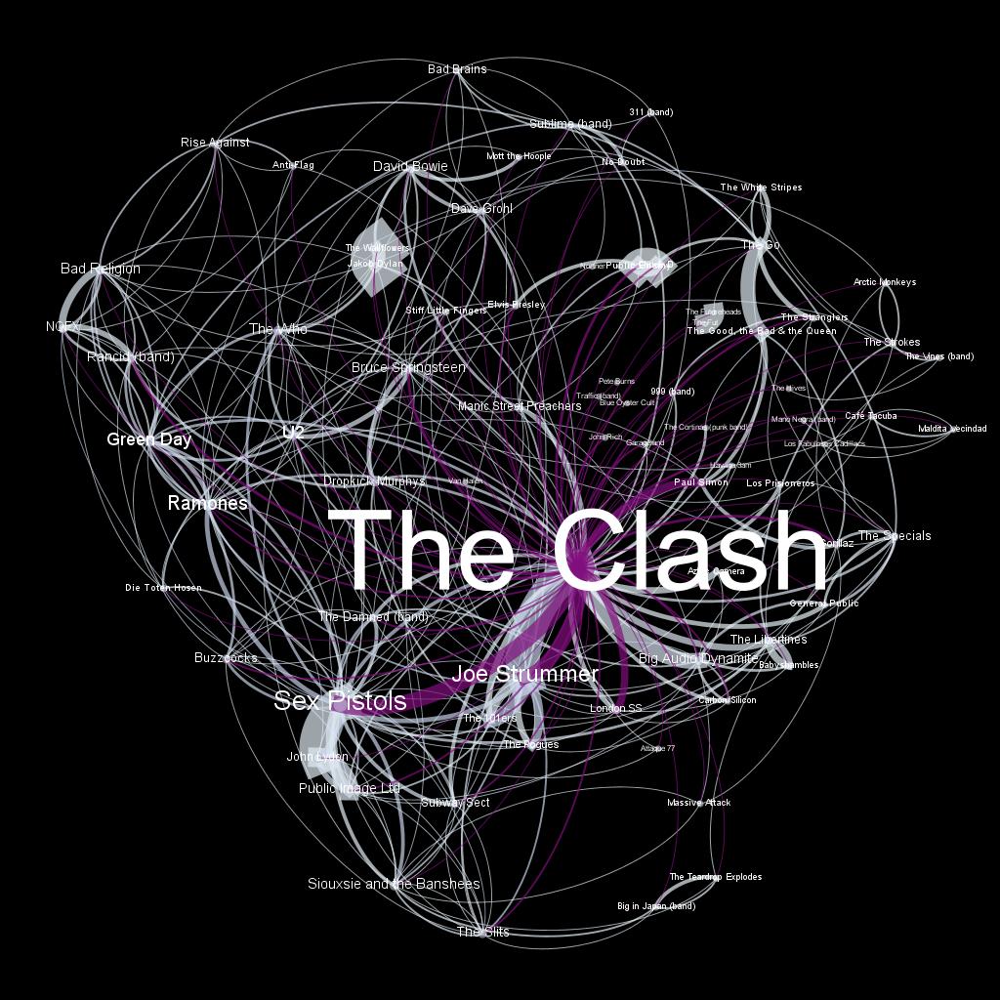
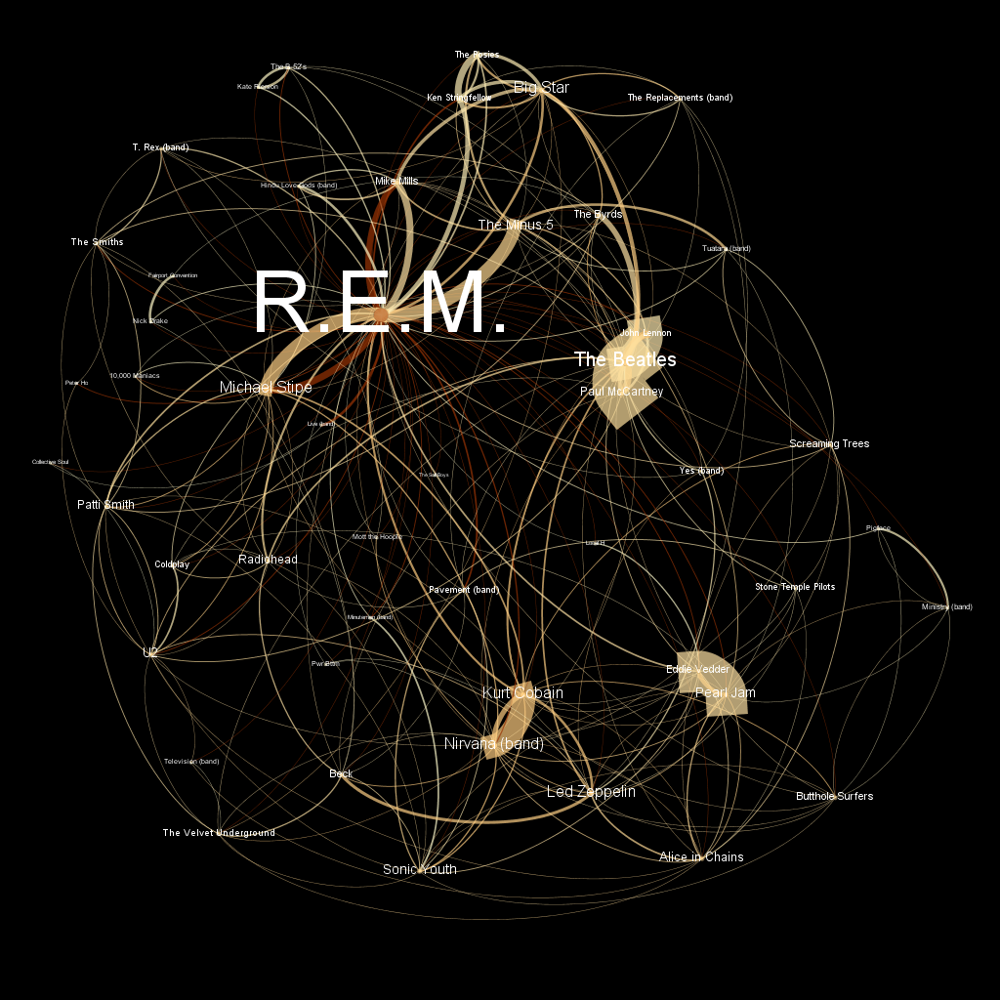

# Wikipedia Music Tree

This repository was created to store scripts that were used in the construction and processing of a dataset containing the links that exist between the Wikipedia articles of musical artists. This dataset has been made available in [Kaggle](https://www.kaggle.com/matwario/wikipedia-music-links).

It also has some images, made with [Gephi](https://gephi.org/), that display (in the shape of graphs) data visualizations of these links.

## Purpose

Wikipedia is one of the internet's richest sources of knowledge. Besides containing information in a textual format, the online encyclopedia is known for having links between its articles, and these can be used to produce interesting insights and visualizations on how articles relate to one another.

In the case of musical artists, links or mentions to articles of other peers can indicate relationships of influence, stylistic proximity, or even collaboration.

Take the following excerpt extracted from the Wikipedia article on [The Rolling Stones](https://en.wikipedia.org/wiki/The_Rolling_Stones). Other artists that are referred to have been highlighted in bold.

*"Having a charting single gave the band entree to play outside London, starting with a booking at the Outlook Club in Middlesbrough on 13 July, sharing the billing with **the Hollies**. Later in 1963 Oldham and Easton arranged the band's first big UK concert tour as a supporting act for American stars including **Bo Diddley**, **Little Richard** and the **Everly Brothers**. The tour gave the band the opportunity to hone their stagecraft. During the tour the band recorded their second single, a **Lennon–McCartney**-penned number entitled 'I Wanna Be Your Man'. The song was written and given to the Stones when **John Lennon** and **Paul McCartney** visited them in the studio as the two Beatles liked giving the copyrights to songs away to their friends."*

In just a few sentences we see how The Rolling Stones have historical links to many other artists. And this happens throughout the band's article as well as those from other bands and musicians around Wikipedia.

The question, then, is: what insights can be produced via these links and mentions? In order to find out, the first step is building a dataset that maps these links throughout Wikipedia and stores them neatly in a file. This is the main purpose of this repository, and with the code stored here (just a few scripts), we will go from building this dataset to being able to produce data visualizations such as this one.



The image above shows bands mentioned in The Clash's Wikipedia article and how they relate to one another. Note that, due to the nature of the visualization, some details are hard to see through the image. Because of that, I have included a PDF version of this image (and a few others) that allows for zooming and better visualization.

## General Information

In general terms, this repository contains:

* The code used to process raw Wikipedia pages and turn them into a neat dataset with three columns: the name of the artist (ARTIST_NAME); and a list of tuples with the artists that are mentioned and how many times they are referred to (MENTIONED_ARTISTS); the Wikipedia category from which the article came (ARTIST_CATEGORY).

* The dataset itself.

* The code used to process that dataset into CSVs that can be fed straight into [Gephi](https://gephi.org/) to generate visualizations such as the one in the previous section.

* A few of those CSVs.

* A bunch of examples (in PDF and PNG format) of the visualizations generated with those CSVs. Note that the PDFs are ideal for this type of visualization since images lose a lot of quality when zooming in.

## Dataset Information

In order for the dataset to be generated exclusively with articles about musical artists, they had to be acquired manually from Wikipedia. The site employs categories to organize articles, and these can in turn be used in [this page](https://en.wikipedia.org/wiki/Special:Export) so that a XML can be downloaded. This XML will have the full content of all articles from the informed category.

The dataset, as made available here, was created with articles/artists that fell into the following categories.

* "Musical groups established in 1950" until "Musical groups established in 2020".
* "20th_century_american_rappers" and "21st_century_american_rappers".
* "20th_century_american_singers" and "21st_century_american_singers".
* "20th_century_australian_singers" and "21st_century_australian_singers".
* "20th_century_brazilian_singers" and "21st_century_brazilian_singers".
* "20th_century_canadian_singers" and "21st_century_canadian_singers".
* "20th_century_english_singers" and "21st_century_english_singers".
* "20th_century_french_singers" and "21st_century_french_singers".

As previously stated, the final dataset is pretty simple, being made up of only two columns. One that lists the artist (ARTIST_NAME) and another that shows the artists that are mentioned in that Wikipedia article as well as how many times those mentions occur (MENTIONED_ARTISTS).

Anyone looking for a dataset with more categories can download XMLs and use the code to build a new one. I couldn't upload the XML files I used to GitHub because they are too large.

## Repository Information

Here's a description of the repository's structure and the files it contains. For more information on the Python scripts, open them to check their comments.

### Code Folder

* build_matrix_from_raw_data.py - The code that builds the dataset. I have yet to optimize it completely (though it has parallel processing), so it can be a bit slow since it involves a lot of text searches. Basically, it processes the downloaded XMLs by turning them into clean CSVs, and then uses those to build the final dataset.

* build_graph_mentions_from_root.py - Code that reads the dataset and builds a CSV that can be fed into Gephi to generate graph visualizations of the links. It takes two parameters: the root_node and the depth. The root_node is the name of an artist and the depth determines how "far away" from that artist the code will go to build the CSV. If depth is 1, the CSV will include all links between the root_node artist and the artists mentioned in its Wikipedia article. If depth is 2, the CSV will include all links between the root_node, the artists mentioned in its Wikipedia article, and the artists mentioned in the articles of these other artists. And so forth.

* build_graph_mentions_to_root - The logic is the same as that of the code above, but the difference is that rather than starting from the root, it looks for artists whose articles have mentions to the root. If depth is 1, the CSV will include all links between the root_node artist and the artists whose articles mention it. If depth is 2, the CSV will include all links between the root_node, the artists whose Wikipedia articles mention it, and the artists whose articles mention these last artists. And so forth.

All codes have arguments that can be set up, but in general they are already defined in a way that makes them work with the current repository structure. Nevertheless, here are examples of how they can be run:

```
$ python build_matrix_from_raw_data.py --relative_path_xml ../data/xml/ --relative_path_csv ../data/csv/ --relative_path_matrix ../data/resulting_mention_matrix/

$ python build_graph_mentions_from_root.py --root_node 'Neil Young' --depth 1

$ python build_graph_mentions_to_root.py --root_node 'The Beatles' --depth 1
```

Note that root_node needs to have the name of the artist exactly as it is on the title of its Wikipedia article. For example, the title of the article of [The Beatles](https://en.wikipedia.org/wiki/The_Beatles) is simply "The Beatles", so that one is easy. But many artists, like [The Replacements](https://en.wikipedia.org/wiki/The_Replacements_(band), have article titles that include the disambiguation term; in that case, root_node needs to include that part, so root_node should be "The Replacements (band)".

### Data Folder

Some of these directories are empty, but they have been added to the repository so it is already in the correct structure for the code to run.

* xml - Folder meant to store XML files downloaded from [Wikipedia](https://en.wikipedia.org/wiki/Special:Export). For the sake of organization, I divided it into musical_groups and singers.

* csv - Before building the matrix, the build_matrix_from_raw_data.py script does some cleaning in the XML files and produces corresponding CSVs that contain only the text that is of interest for our problem. This is where they will be stored.

* resulting_mention_matrix - Folder where the final dataset is stored.

* graph_data - Folder that stores the CSVs generated by the build_graph_mentions_from_root.py and build_graph_mentions_to_root.py scripts. The CSVs present here are ready to be fed into Gephi to create visualizations.

### Image Folder

This one is just for show. I added PDF and PNG versions of the visualizations I created in Gephi with this dataset. Again, the former format is better because these graphs have a lot of small details that can only be seen by zooming in, and doing that in the image is nearly impossible because of their limited quality. With PDFs, there is no such problem and it is possible to explore the graphs as much as it is desired.

Just as an added note on these images, the size of the nodes and the size of the artists' names correspond to how many links there are coming in and out of their articles. Meanwhile, the thickness of the edges is related to the number of mentions between artists: a very thick line between R.E.M. and The Minus 5, as seen below, shows their articles refer to one another quite a bit. Plus, with the configuration in which the graph was generated, there is no distinction made between incoming and outgoing links; they are joined in the same edge.


